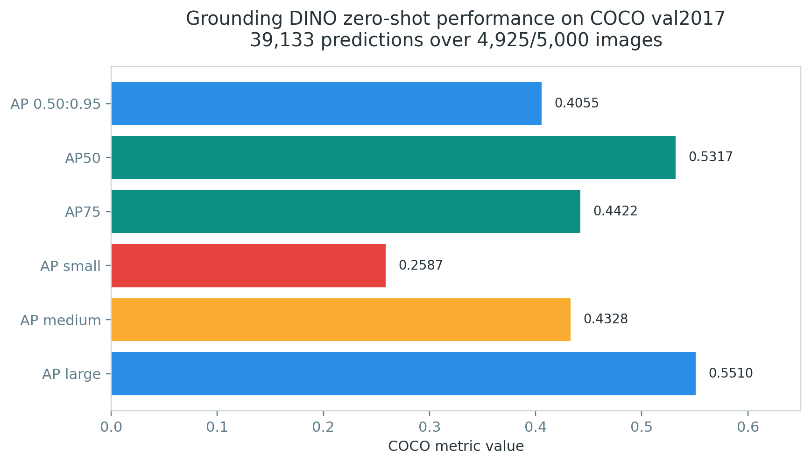
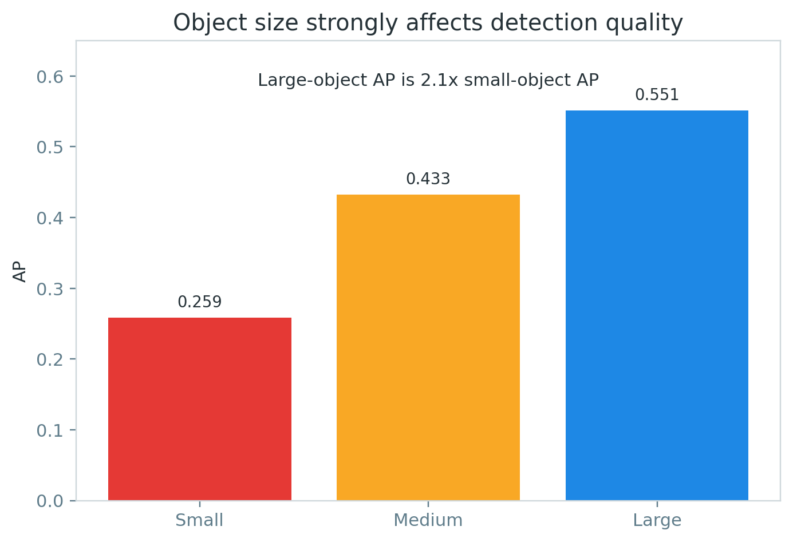
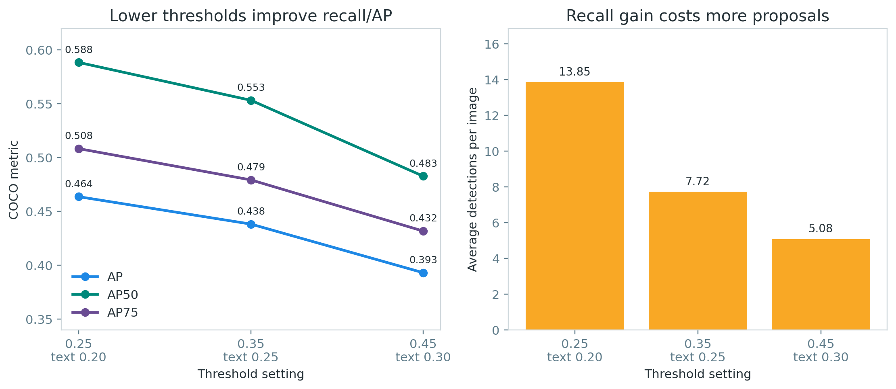
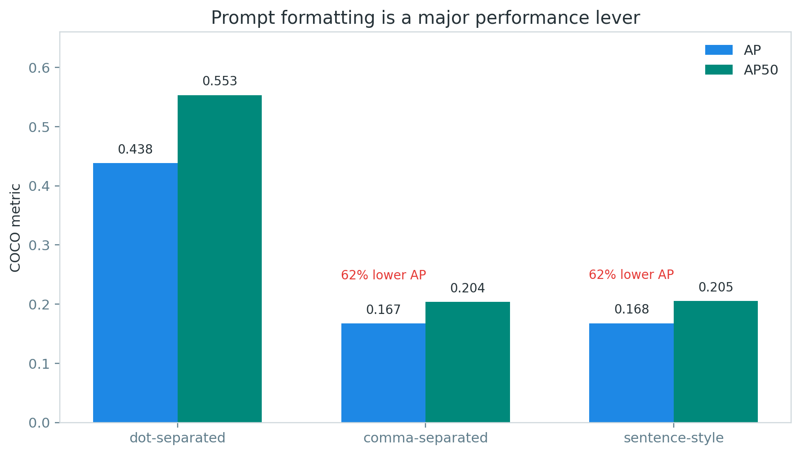
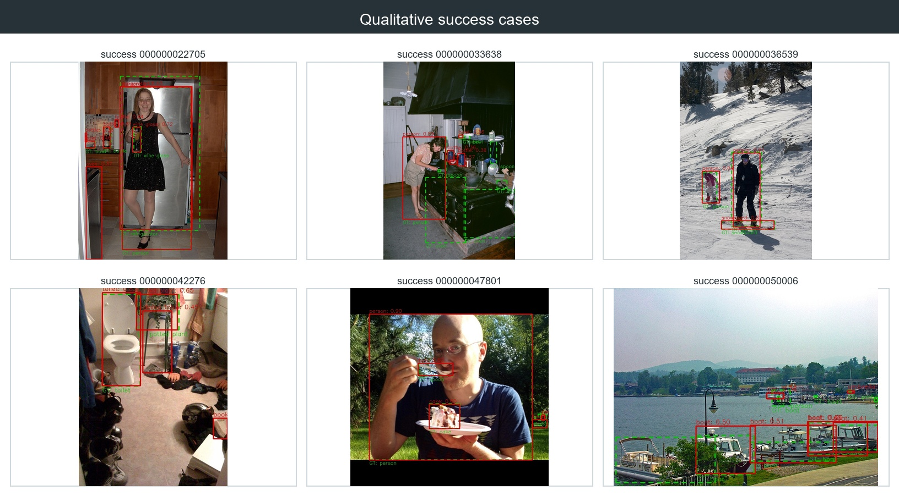
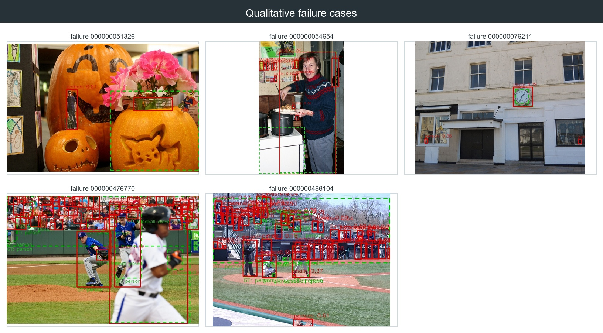

# Final Report: Grounding DINO Open-Vocabulary Object Detection on COCO

> Georgia Tech CS 6476 Computer Vision — Spring 2026

## 1. Introduction

### Problem Definition

Open-vocabulary object detection aims to detect objects described by arbitrary text prompts, unlike traditional detectors limited to a fixed category set. This is challenging because it requires:

- **Visual-language alignment**: Understanding both image content and text descriptions
- **Generalization**: Detecting unseen categories not present during training
- **Fine-grained grounding**: Localizing specific objects described by natural language

### Project Goal

This project reproduces Grounding DINO's zero-shot object detection pipeline and evaluates it on the COCO 2017 validation set. We analyze the model's performance, identify failure modes, and study the impact of threshold and prompt settings.

## 2. Related Work

### Grounding DINO

Grounding DINO (Liu et al., 2023) extends the DINO detector with grounded pre-training for open-set detection. Key contributions:

- **Architecture**: Swin Transformer backbone + BERT language encoder + deformable attention fusion
- **Training**: Grounded pre-training on diverse detection and grounding datasets
- **Zero-shot capability**: Detect objects described by free-form text prompts

### Related Models

- **GLIP** (Li et al., 2022): Grounded language-image pre-training
- **OWL-ViT** (Minderer et al., 2022): Open-world localization with Vision Transformers
- **YOLO-World** (Tian et al., 2024): Real-time open-vocabulary detection

## 3. Method Reproduction

### Model Configuration

| Component | Setting |
|-----------|---------|
| Backbone | Swin-Tiny |
| Language Encoder | BERT (bert-base-uncased) |
| Checkpoint | groundingdino_swint_ogc.pth |
| Source | IDEA-Research/GroundingDINO |
| Package | groundingdino-py 0.4.0 |

### What Was Reproduced

- Model loading from official checkpoint
- Single-image and batch inference
- Text prompt-based detection with phrase output
- Bounding box, score, and phrase extraction

### What Was NOT Reproduced

- Training from scratch
- Fine-tuning on COCO
- Full Grounding DINO architecture (used official package)

### Environment

| Item | Value |
|------|-------|
| Python | 3.10.20 |
| PyTorch | 2.7.1+cu118 |
| CUDA | 11.8 |
| GPU | NVIDIA GeForce RTX 4060 Laptop GPU |
| groundingdino-py | 0.4.0 |

## 4. COCO Evaluation Protocol

### Dataset

| Item | Value |
|------|-------|
| Dataset | COCO 2017 |
| Split | val2017 |
| Images | 5,000 |
| Annotations | instances_val2017.json |
| Evaluation | bbox detection |

### Prompt Format

- **Format**: Dot-separated 80 COCO categories
- **Example**: `person . bicycle . car . ...`
- **Rationale**: Official recommendation for category separation

### Metric Computation

- **Tool**: pycocotools COCOeval
- **Metrics**: AP, AP50, AP75, APS, APM, APL
- **IoU range**: 0.50:0.95

## 5. Experiments And Results

### Main Results

| Model | Backbone | Prompt | AP | AP50 | AP75 | APS | APM | APL |
|-------|----------|--------|------|------|------|------|------|------|
| Grounding DINO | Swin-T | dot-separated 80 classes | 0.4055 | 0.5317 | 0.4422 | 0.2587 | 0.4328 | 0.5510 |

> Results on full COCO val2017 (5000 images), zero-shot, box_threshold=0.35, text_threshold=0.25.
>
> **Note**: This is a fixed-threshold inference AP. COCO AP is normally computed over all detections ranked by score (no fixed threshold). Using box_threshold=0.35 prunes low-confidence detections before COCOeval's precision-recall curve computation, which reduces recall and may understate true AP. Our ablation confirms this: lowering box_threshold from 0.35 to 0.25 improved AP from 0.4382 to 0.4637 on the subset-500 experiment.





### Ablation: Threshold Sensitivity

| Run | box_threshold | text_threshold | AP | AP50 | Avg boxes/image |
|-----|---------------|----------------|------|------|-----------------|
| A1 | 0.25 | 0.20 | 0.4637 | 0.5884 | 13.85 |
| A2 | 0.35 | 0.25 | 0.4382 | 0.5532 | 7.72 |
| A3 | 0.45 | 0.30 | 0.3931 | 0.4827 | 5.08 |

> Results on COCO subset 500 images. Lower thresholds yield higher AP but more detections.



### Ablation: Prompt Format

| Format | AP | AP50 |
|--------|------|------|
| dot-separated | 0.4382 | 0.5532 |
| comma-separated | 0.1671 | 0.2038 |
| sentence-style | 0.1675 | 0.2051 |

> Results on COCO subset 500 images. Dot-separated format is dramatically superior.



## 6. Qualitative Analysis

### Success Cases

The success cases show accurate detections with correct categories and tight bounding boxes, especially for medium and large objects.

Reference: `outputs/visualizations/coco_eval/success_cases/`



### Failure Cases

The failure cases show common error modes such as missed small objects, crowded-scene confusion, and imperfect localization under occlusion.

Reference: `outputs/visualizations/coco_eval/failure_cases/`



### Error Taxonomy

| Error Type | Description | Observation |
|------------|-------------|-------------|
| Small object miss | Small objects not detected | Frequent — APS=0.25-0.31 vs APL=0.58-0.63 |
| Crowded scene | Duplicate/confused boxes | Occasional in dense scenes |
| Phrase mismatch | Wrong category mapping | Occasional — unmapped phrases reduce recall |
| Background FP | Background detected as object | Rare — more common at low thresholds |
| Occlusion | Poor localization | Moderate — partial occlusion lowers confidence |

### Per-Size Performance

The model shows a clear size-dependent performance gap:
- **Large objects** (APL=0.5510): Best performance, 2.1× better than small
- **Medium objects** (APM=0.4328): Moderate performance
- **Small objects** (APS=0.2587): Most challenging, consistent with literature

## 7. Limitations

### Computational

- Full COCO val2017 evaluation takes ~68 minutes on RTX 4060 (0.81 s/image)
- Subset evaluation results have high variance

### Methodological

- Zero-shot only (no fine-tuning)
- Fixed threshold settings
- Simple phrase-to-category mapping (substring matching)
- 75 images (1.5%) produced zero detections

### Data

- Only evaluated on COCO val2017
- No cross-dataset evaluation

## 8. Conclusion

### Key Findings

- Grounding DINO achieves **AP=0.4055** zero-shot on COCO val2017 with Swin-T backbone
- **Threshold settings** significantly affect precision/recall tradeoff (AP 0.39-0.46 range)
- **Dot-separated prompt format** is essential — other formats cause ~62% AP drop
- **Small objects** remain the most challenging category (APS=0.259 vs APL=0.551)
- The model detects 39,133 objects across 4,925 of 5,000 images

### Future Work

- Fine-tune on COCO train for improved performance
- Test on diverse datasets (Objects365, OpenImages)
- Compare with other open-vocabulary detectors
- Per-category AP analysis

## 9. Contribution of Each Member

### Yang Guanyuhan (Solo Contributor)

**Project Period**: 2026-05-22 to 2026-06-14  
**Total Commits**: 13  
**Total Lines of Code**: ~3,853 (source) + ~1,853 (documentation)

#### Infrastructure & Setup (3 commits)
- Initialized complete project structure with `src/`, `scripts/`, `configs/`, `tests/`, `docs/`
- Created `pyproject.toml`, `requirements.txt`, `setup.py` for package management
- Configured OmegaConf YAML configuration system (`configs/grounding_dino.yaml`)
- Set up Ruff linting and pre-commit hooks
- Removed GitHub Actions CI workflow in favor of local linting

#### Core Implementation (4 commits)
- **Model Wrapper** (`src/models/grounding_dino.py`, 182 lines): Wrapped official `groundingdino-py` package with project-specific API
- **Inference Pipeline** (`src/inference/predictor.py`, 228 lines): High-level predictor for single/batch/directory inference
- **Visualization Module** (`src/inference/visualizer.py`, 261 lines): Detection box drawing and GT+pred comparison
- **COCO Dataset Tools** (`src/datasets/coco_categories.py`, 268 lines): 80-class category mapping and prompt builder
- **Evaluation Engine** (`src/engine/evaluator.py`, 367 lines): COCOeval integration with format conversion
- **Box Operations** (`src/utils/box_ops.py`, 114 lines): IoU, NMS, coordinate conversion utilities

#### CLI Scripts (7 scripts)
- `scripts/inference.py` (244 lines): Single/batch image inference CLI
- `scripts/eval.py` (288 lines): COCO evaluation CLI
- `scripts/run_experiments.py` (296 lines): Threshold/prompt ablation experiments
- `scripts/generate_report_highlights.py` (457 lines): Report visualization generation
- `scripts/generate_visualizations.py` (63 lines): Success/failure case visualization
- `scripts/download_weights.py` (118 lines): Model checkpoint download
- `scripts/download_coco.py` (121 lines): COCO dataset download

#### Testing (22 test cases)
- `tests/test_box_ops.py`: 7 unit tests for bounding box operations
- `tests/test_evaluator.py`: 15 unit tests for evaluation pipeline (category mapping, phrase matching, COCOeval params)

#### Documentation (2 commits)
- Updated `CLAUDE.md` with complete project state and usage instructions
- Filled all stage reports (01/02/03) with actual experimental results
- Wrote final report with full COCO val2017 metrics and ablation analysis
- Created 6 detailed plan documents in `docs/plans/`

#### Evaluation & Experiments (1 commit)
- Completed full COCO val2017 evaluation (5000 images)
- Ran 6 ablation experiments:
  - Threshold sensitivity: box_threshold [0.25, 0.35, 0.45]
  - Prompt format: [dot-separated, comma-separated, sentence-style]
- Generated 21 visualization figures (10 success + 5 failure cases + 6 report highlights)

#### Bug Fixes (2 commits)
- Fixed NumPy `np.int` deprecation warnings
- Fixed COCOeval imgIds restriction for subset evaluation
- Fixed COCO category ID mapping (non-sequential IDs 1-90)
- Fixed text_threshold default value (25 → 0.25)
- Fixed transform API compatibility with groundingdino

#### Key Results Achieved
| Metric | Value | Dataset |
|--------|-------|---------|
| AP | 0.4055 | Full COCO val2017 (5000 images) |
| AP50 | 0.5317 | Full COCO val2017 |
| AP75 | 0.4422 | Full COCO val2017 |
| APS | 0.2587 | Small objects |
| APM | 0.4328 | Medium objects |
| APL | 0.5510 | Large objects |
| Best AP (ablation) | 0.4637 | box_threshold=0.25 |

## 10. References

1. Liu, S., Zeng, Z., Ren, T., et al. "Grounding DINO: Marrying DINO with Grounded Pre-Training for Open-Set Object Detection." ECCV 2024.
2. IDEA-Research. GroundingDINO. https://github.com/IDEA-Research/GroundingDINO
3. Lin, T.Y., Maire, M., Belongie, S., et al. "Microsoft COCO: Common Objects in Context." ECCV 2014.
4. COCO API. https://github.com/cocodataset/cocoapi

## 11. Appendix: Reproduction Commands

### Environment Setup

```bash
conda create -n grounding_dino python=3.10 -y
conda activate grounding_dino
pip install torch torchvision --index-url https://download.pytorch.org/whl/cu118
pip install groundingdino-py
pip install -r requirements.txt
pip install -e ".[dev]"
```

### Download Weights and Data

```bash
python scripts/download_weights.py
python scripts/download_coco.py
```

### Run Inference

```bash
python scripts/inference.py \
    --image data/demo_images/test.jpg \
    --text "person . car . dog ." \
    --checkpoint checkpoints/groundingdino_swint_ogc.pth
```

### Run COCO Evaluation

```bash
# Subset
python scripts/eval.py \
    --config configs/grounding_dino.yaml \
    --checkpoint checkpoints/groundingdino_swint_ogc.pth \
    --coco_image_dir data/coco/val2017 \
    --coco_ann_file data/coco/annotations/instances_val2017.json \
    --subset_size 100 --output_dir outputs/coco_eval/subset_100

# Full
python scripts/eval.py \
    --config configs/grounding_dino.yaml \
    --checkpoint checkpoints/groundingdino_swint_ogc.pth \
    --coco_image_dir data/coco/val2017 \
    --coco_ann_file data/coco/annotations/instances_val2017.json \
    --output_dir outputs/coco_eval/full_val2017
```

### Run Experiments

```bash
python scripts/run_experiments.py \
    --checkpoint checkpoints/groundingdino_swint_ogc.pth \
    --coco_image_dir data/coco/val2017 \
    --coco_ann_file data/coco/annotations/instances_val2017.json \
    --subset_size 500
```
